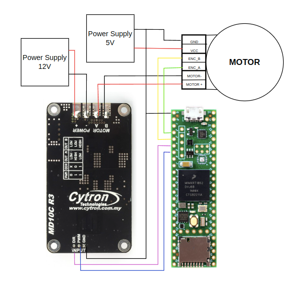
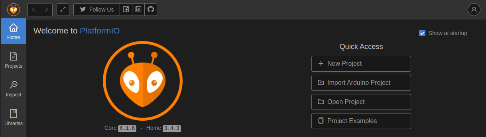
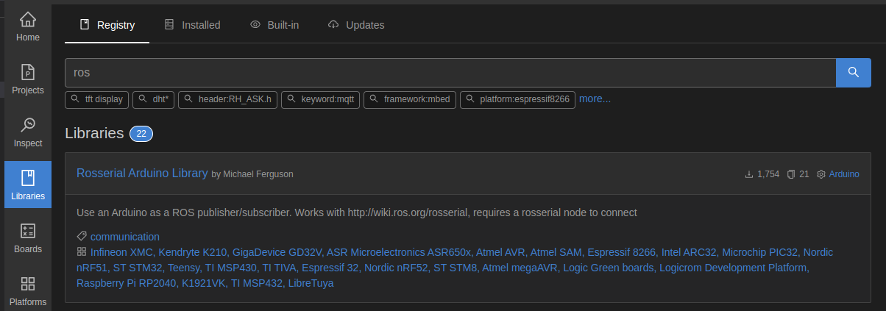

# **PWM-Motor-Control-ROS**
## **Introduction:**

This package explains how to control  PWM DC motors and Servo motors using ROS

&nbsp;
## **Components Used**:
- RHINO 60RPM 40KGCM 12V DC PLANETARY GEARED QUAD ENCODER SERVO MOTOR - 1
- Cytron DC Motor Driver MD10C -1
- 12 V DC Power supply
- BreadBoard
- Jumper Wires
- Teensy 4.1

&nbsp;

## **Pre-Requisite:**
- ROS Noetic
- VS Code with PlatformIO 

&nbsp;
&nbsp;

## **Circuit Diagram & Connections**
- ENC A --> Pin 2
- ENC B --> Pin 3
- DIR  -->  Pin 4
- PWM  ---> Pin 5

- 

&nbsp;
## **Procedure**:

1. Create New Project 
&nbsp;
2. Name the project, Select Board teensey 4.1


3. Create src/main.cpp, paste the code present in src folder. Change the CPR Value for adjusting the angle of rotation of motor.
&nbsp;
&nbsp;

4. Go to Include folder and make a file named PositionControl.h and paste the given code.
&nbsp;

5. Go to libraries section and search for ros. Download the Rosserial Arduino Library by Michael Ferguson. Select the project name and add project dependency.  

6. Add one more library named 'AutoPID' using same method.
&nbsp;
7. Compile the Code and upload to teensey.
8. Run the below commands in separate terminals:-

9. Terminal 1: 
```
roscore
```

10. Terminal 2: 

```
rosrun rosserial_arduino serial_node.py /dev/ttyACM0 _baud:=9600
```
11. Terminal 3: 
```
*rostopic pub /position_in std_msgs/Float32 "data: 10.0" -1*
```
